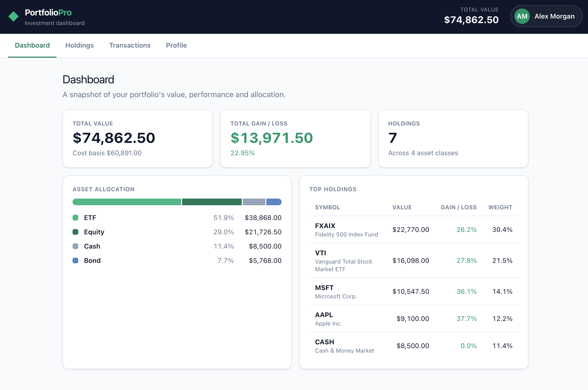
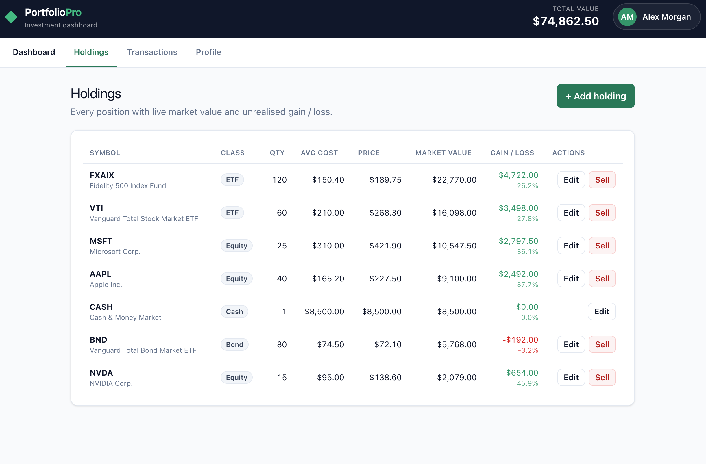
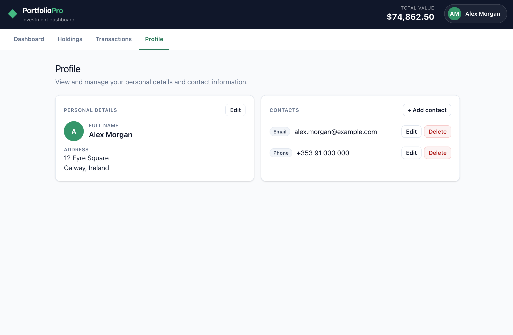

# PortfolioPro — Investment Portfolio Dashboard

**Author:** Adarsh Vishwakarma

## Description

PortfolioPro is a full-stack **investment portfolio dashboard**. It lets a user track their
holdings, see the total value and unrealised gain/loss of their portfolio, view how their
money is allocated across asset classes, browse a history of transactions, and manage their
profile and contact details.

The frontend is a modern **Angular 22** single-page application built with standalone
components, signals and Tailwind CSS. It talks over HTTP (using **Axios**) to a small
**Express** REST API, which stores its data in JSON files that act as a lightweight,
file-backed database. Every list supports full **CRUD** (create, read, update, delete), and
because the API writes back to disk, changes persist across page refreshes.

The project is intentionally small and readable — it is a focused demonstration of modern
full-stack Angular patterns (signals-based state, lazy-loaded routes, reactive forms,
a typed HTTP layer, and unit-tested business logic).

> Sample data only — no real money. Writes are persisted to the JSON files under
> `server/data`, so changes survive a page refresh. To reset to the seed data, run
> `git checkout server/data`.

## Screenshots

### Dashboard
Portfolio value, gain/loss, asset allocation and top holdings.



### Holdings
Every position with live market value and gain/loss, plus add / edit / sell actions.



### Profile
Personal details and full CRUD on contacts.



## Features

- **Dashboard** — total value, total gain/loss, an asset-class allocation bar, and top holdings.
- **Holdings** — a full positions table; **add**, **edit** and **sell** positions through a
  validated reactive form (average cost is recalculated when topping up a position).
- **Transactions** — buy/sell/dividend history with a filter by type; new activity is logged
  automatically when you trade.
- **Profile** — view and **edit** personal details (name + address) and perform full CRUD on
  contact entries (phone/email/other). Editing the name instantly updates the avatar initials
  in the top bar, demonstrating shared signal-based state.

## Technologies used

| Technology | Version | Role |
| --- | --- | --- |
| [Angular](https://angular.dev) | 22.2.1 | Frontend SPA framework (standalone components, signals, new control flow) |
| [Angular CLI](https://angular.dev/tools/cli) | 22.2.2 | Build, serve and test tooling |
| [TypeScript](https://www.typescriptlang.org) | 6.0.3 | Language (strict mode) |
| [RxJS](https://rxjs.dev) | 7.8.2 | Reactive primitives (ships with Angular) |
| [Axios](https://axios-http.com) | 1.20.0 | HTTP client used to call the REST API |
| [Express](https://expressjs.com) | 5.2.1 | REST API server |
| [cors](https://www.npmjs.com/package/cors) | 2.8.6 | CORS middleware for the API |
| [Tailwind CSS](https://tailwindcss.com) | 4.3.3 | Utility-first styling |
| [@tailwindcss/postcss](https://tailwindcss.com) | 4.3.3 | Tailwind's PostCSS plugin |
| [Vitest](https://vitest.dev) | 5.0.3 | Unit test runner (via Angular's test builder) |
| [concurrently](https://www.npmjs.com/package/concurrently) | 10.0.5 | Runs the API and web app together in dev |
| [Node.js](https://nodejs.org) | 20+ (built with 25.2.1) | JavaScript runtime |
| npm | 11.6.2 | Package manager |

> The app runs **zoneless** (no `zone.js`) — change detection is driven entirely by signals.

## Folder structure

```
Angular_Demo/
├─ server/                              # Backend: Express REST API + JSON "database"
│  ├─ index.js                          # API server and all CRUD endpoints
│  └─ data/
│     ├─ portfolio.json                 # holdings + transactions data store
│     └─ profile.json                   # profile + contacts data store
│
├─ src/                                 # Frontend: Angular application
│  ├─ main.ts                           # app bootstrap
│  ├─ index.html                        # host page
│  ├─ styles.css                        # global Tailwind styles + component recipes
│  └─ app/
│     ├─ app.ts / app.html              # shell: loads data on boot, top bar, nav, outlet
│     ├─ app.config.ts                  # application providers (router, etc.)
│     ├─ app.routes.ts                  # lazy-loaded routes (loadComponent)
│     ├─ app.spec.ts                    # shell unit test
│     ├─ core/
│     │  └─ api.ts                       # shared Axios instance (baseURL /api)
│     ├─ models/
│     │  ├─ portfolio.models.ts          # Holding / Transaction / summary types
│     │  └─ profile.models.ts            # Profile / Contact types
│     ├─ services/
│     │  ├─ portfolio.service.ts         # fetches holdings/transactions via Axios → signals
│     │  ├─ portfolio.logic.ts           # pure derivation functions (summary, allocation…)
│     │  ├─ portfolio.logic.spec.ts      # unit tests for the pure logic
│     │  ├─ profile.service.ts           # fetches/updates the profile via Axios → signals
│     │  ├─ profile.logic.ts             # pure helper (initials)
│     │  └─ profile.logic.spec.ts        # unit tests for the pure logic
│     └─ features/
│        ├─ dashboard/                   # summary cards + allocation + top holdings
│        ├─ holdings/                    # positions table + add/edit reactive form
│        ├─ transactions/                # filtered activity history
│        └─ profile/                     # profile details + contacts CRUD
│
├─ public/                              # static assets (favicon, etc.)
├─ proxy.conf.json                      # dev proxy: /api → http://localhost:3000
├─ .postcssrc.json                      # Tailwind PostCSS config
├─ angular.json                         # Angular workspace config
├─ package.json                         # scripts and dependencies
├─ tsconfig*.json                       # TypeScript configuration
└─ README.md
```

## Architecture

**Data flow:** component → service method → **Axios** → **Express API** → JSON file.
The API returns the updated data, which the service stores in **signals**; `computed` signals
derive views and summaries, so the UI stays in sync without manual change detection or
subscriptions. In development the Angular dev server proxies `/api/*` to the API on port 3000
(see [`proxy.conf.json`](proxy.conf.json)), so there are no CORS issues.

### REST API endpoints

| Method | Path | Purpose |
| --- | --- | --- |
| GET | `/api/holdings` | list holdings |
| POST | `/api/holdings` | add / top up a holding |
| PUT | `/api/holdings/:id` | update a holding |
| POST | `/api/holdings/:id/sell` | sell (reduce/remove) a holding |
| GET | `/api/transactions` | list transactions |
| GET | `/api/profile` | get the profile |
| PUT | `/api/profile/details` | update name + address |
| POST | `/api/profile/contacts` | add a contact |
| PUT | `/api/profile/contacts/:id` | update a contact |
| DELETE | `/api/profile/contacts/:id` | delete a contact |

## Getting started

Requires Node 20+ and npm.

```bash
npm install
npm run dev        # runs the API (port 3000) AND the Angular app (port 4200) together
```

Then open http://localhost:4200.

Run the pieces individually if you prefer:

```bash
npm run api        # just the Express API on port 3000
npm start          # just the Angular dev server on port 4200
```

Other commands:

```bash
npm run build      # production build into dist/
npm test           # run the unit tests once (13 tests)
git checkout server/data   # reset the "database" to the seed data
```
